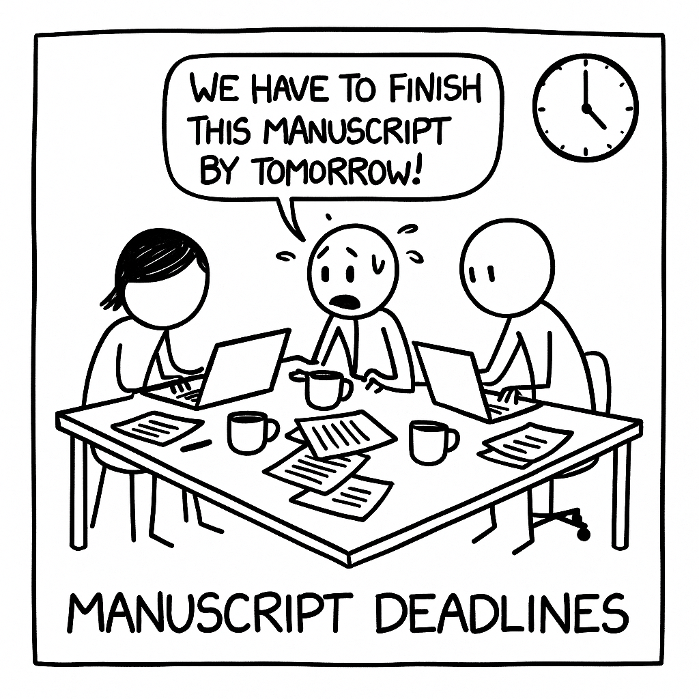
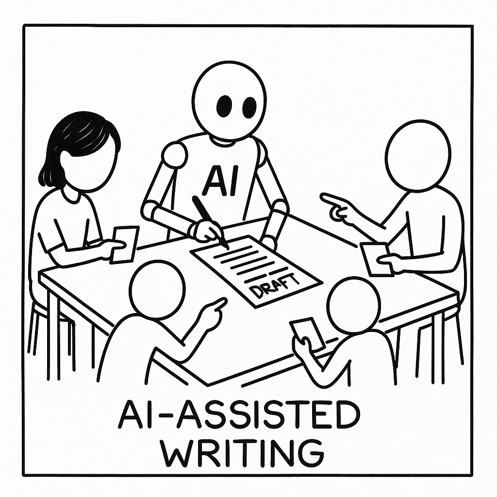

# Manugen AI - Agent Development Kit Hackathon with Google Cloud

## What Inspired Us

From the outset, we were captivated by the promise of autonomous AI agents collaborating to tackle complex, multidisciplinary tasks. The Agent Development Kit Hackathon with Google Cloud challenged participants to “build autonomous multi-agent AI systems” capable of content creation, among other applications.

Recognizing that writing a rigorous scientific manuscript involves navigating vast literature, synthesizing nuanced insights, and maintaining a coherent narrative, we saw an opportunity to apply multi-agent orchestration to streamline and elevate the research-writing process. The hackathon’s emphasis on orchestrated agent interactions inspired us to ask: what if specialized agents—each expert in retrieval, summarization, drafting, and revision—could work in concert to produce a high-quality scientific paper?

## What We Learned

- **Modular Agent Design Is Essential.** By decomposing the writing process into discrete stages—literature retrieval, abstract summarization, section drafting, and peer-review simulation—we discovered that agents with narrowly scoped responsibilities could be more effectively tuned and evaluated. This division of labor not only improved output quality but also made debugging and iterating on individual components far more manageable.  
- **Prompt Engineering Drives Quality.** Small changes in how we prompted each agent had outsized effects on coherence, style, and factual accuracy. Iteratively refining prompts based on error modes (e.g., hallucinations in data-driven sections, insufficient context in methods descriptions) emerged as a critical skill.  
- **Integrating Retrieval Strengthens Rigor.** Leveraging a dedicated retrieval agent connected to Google Cloud’s BigQuery repository of scientific abstracts ensured that our drafts were firmly grounded in existing literature, rather than relying solely on generative models. This hybrid retrieval-augmented approach significantly reduced instances of fabricated citations and improved the manuscript’s scientific credibility.  
- **Automated Feedback Is Powerful, but Imperfect.** Implementing a “peer-review” agent that applied heuristic and model-based checks (e.g., ensuring the presence of hypothesis statements, verifying statistical claims against source data) highlighted both the potential and current limitations of automated review. While it caught many structural issues, nuanced scientific arguments still required human oversight.

## How We Built Our Project

1. **Agent Development Kit (ADK) Framework.**  
   We used the Python version of ADK to define each agent’s behavior and orchestrate the workflow, tapping into its built-in support for asynchronous execution and state management.  
2. **Agent Roles & Pipeline:**  
   - **Retrieval Agent:** Queries a BigQuery dataset of open-access publications to fetch relevant abstracts and figures based on user-specified keywords.  
   - **Summarization Agent:** Applies a transformer-based model to condense each abstract into key findings, ensuring brevity without loss of nuance.  
   - **Drafting Agent:** Constructs full manuscript sections (Introduction, Methods, Results, Discussion) by synthesizing the summarized findings and applying scientific writing templates.  
   - **Revision Agent:** Reviews the draft for logical flow, missing references, and adherence to journal guidelines, issuing targeted revision prompts for earlier agents.  
3. **Cloud Integration.**  
   We deployed critical components—such as the retrieval agent and data-processing pipelines—on Cloud Run, and used Cloud Functions to trigger agent workflows in response to user requests. This setup allowed scalable, low-latency execution while keeping costs manageable.  
4. **User Interface.**  
   A simple web dashboard (hosted on App Engine) let users specify topics, view intermediate outputs from each agent, and download the final compiled manuscript as a LaTeX or Word document.

## Challenges We Faced

- **Maintaining Coherence Across Agents.**  
  As agents operated asynchronously, ensuring that context (e.g., variable definitions, methodological details) persisted seamlessly between stages required rigorous state-management strategies and periodic context re-injection.  
- **Balancing Creativity and Accuracy.**  
  Generative models can produce eloquent prose but may introduce factual inconsistencies. We mitigated this by tightly coupling drafting with retrieval, but tuning the trade-off between expressive writing and strict factuality was an ongoing challenge.  
- **Scaling Retrieval Latency.**  
  Querying large publication databases in real time sometimes introduced delays. Caching strategies and batched queries alleviated but did not eliminate occasional slowdowns under hackathon time constraints.  
- **API Quotas and Cost Management.**  
  Operating multiple LLM calls and BigQuery operations risked hitting free-tier limits. We implemented usage monitors and fail-safes to throttle non-essential tasks, but these added complexity to our orchestration logic.  
- **Human-in-the-Loop Necessity.**  
  Despite our multi-agent setup, final quality assurance still relied on human review for nuanced interpretation, ethical considerations (e.g., avoiding unintended bias), and the final polish necessary for publication-ready prose.
